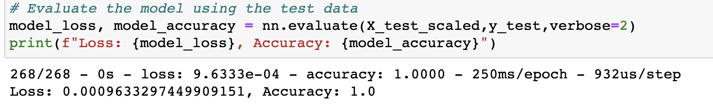
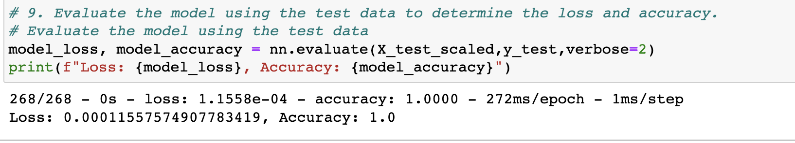

# Neural_Network_Charity_Analysis
* Scikit-Learn’s 
* StandardScaler()
* Simoid, relu (Activation functions)
* Random Forest Classifier
* Pandas
* Tensorflow

# 1. Overview of the analysis:

   The Alphabet Soup Company wants to give some funds for a serie of companies mentioned in a given data base, so we can analyse the. there are more columns besides these ones containing the companies names, so in order to process this iformation, the data base should be clean, it means to be sure the type of values are numerical, so, for those values where their types are categoricals, they need to be trasnform into numericals, also it is neccesary to eliminate those columns that don't have relation with the numerical values. 
   
  The second part of this challenge is to visualized the total of values to use for each column,  made this, the data base will be encoded, it means it will be transfomed into 1 and 0 values.
  
  The third part will be to merge the encoded data frame with the original, erasing those columns that dont have the encoded columns. Done this we can say we have the neccesary data to define the features and target colum. The next step is to standarized the features applying the StandardScaler function so we can fit it with the features array.
  
  The mentioned above is part of the begining to create a deep neural network model, which is going to content inputs, neurons, layers and activation functions (the ones willbe choosen by the developer according the data characteristics).
  This model must be compile, trained and evaluated by getting the loss and accuracy.

# 2. Results:

* ***Data Preprocessing***

- **What variable(s) are considered the target(s) for your model?**
  The "Status" column is considered the target.
  
- **What variable(s) are considered to be the features for your model?**
  The variables considered for the features is our array with the data set cleaned and the columns encoded, droping the     target column ("Status").
  
- **What variable(s) are neither targets nor features, and should be removed from the input data?**
  The Ein and Name columns are not features due they are just Identification of the columns so there is not realtionship with the numerical features, the values where the differents categories for each column have less values or are uncommon and that were determined with the plot.density function, those values will be the ones where the value counts watched in the plot "fall off" and set the threshold within this region and should be categorized as the "other" value, this step has to be done in each column where the number of values for each category is greater than 10 values.
  
- ***Compiling, Training, and Evaluating the Model***

- How many neurons, layers, and activation functions did you select for your neural network model, and why?
   For the first analysis (AlphabetSoupCharity), 8 neurons were used for the first layer, and 5 neurons for the second layer, the activation function used were `relu`and `sigmoid` respectively. The **sigmoid** activation function was used due we wanted a binary classification, and the values would be normalized between 0 to 1. Meanwhile the use of the **relu** activation function was used beacuse values are nonlinear and positive and because we could make regression analysis. For the second analysis (AlphabetSoupCharity_Optimzation), the amount of neurons used were 86 for each layer, this number was decided totake due it is recomended to take two to three times the numbe of inputs, in this case the number of input features were 43, so 43 X 2 = 86, but doing these the accuracy an loss diferer a little beat fro the first analysis. 
   
- Were you able to achieve the target model performance?

In this case the model didn´t need to change any code made previously,or activation function beacuse the results or summary show an accuracy of almost 100%, there is only a tiny loss or about: 0.0009633297449909151. This way, the achieve in the model performance was efficiently higher than 75% mentioned in canvas.

- What steps did you take to try and increase model performance?
To increase the number of neurons base on the rule that says that neurons must be two to three times the number of inputs.   

             

Summary:

For the AlphabetSoup_Charity_Optimzation there was a little change in the number of neurons introduced, according with the `X_train[0]`values equals to 43, representing the inputs in the model, there is a recommendation where it says that in order to have better results, the number of layers must be two to three times the number of inputs, then while defining the deep neural net model, the number of hidden_nodes_layer1 is equal to 86 ( 43*2 = 86), doing the same for the hidden_nodes_layer2 = 86, whit this data the result for the accuracy did't have a change, but there is variation in the loss, it was reduced a little bit so we could say that the increase of neurons in this case make the model better, the cost for the model was reduced slighly,at the end the model  suffered an improvement.

The activation functions recomended in case we have negative values is : The Leaky ReLU function due is a good alternative for nonlinear input data with many negative inputs.

The tanh function can be used for classification or regression, and it expands the range between -1 and 1, in case we need a longer range, the most comun use in this method is when the data set contains too many values.

